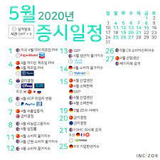

<html>

<head>
  <title>HTML - HiSohi</title>
  <meta charset="utf-8">
  <meta name="viewport" content="width=device-width, initial-scale=1.0">
</head>
  </html>
<body>
<h1><a href="index.html">Hi_sohi</a></h1>
<ol>
  제일약품 담당자 임소희 
  스도쿠 답 
  이 달의 제일 - 슈프레인(1) 
  증시일정  

<h3>제일약품 담당자 임소희</h3>
제일약품 담당자 임소희  
e-mail : hi_sohi@jeilpharm.co.kr  
phone : 010-4108-3514
</body>
</html>

<h3>스도쿠 답</h3>
<html>
<body>
  
</body>
</html>

<h3>이달의 제일 - 슈프레인 (1)</h3>
<html>
<body>
  
</body>
</html>

<h3>증시일정</h3>
<html>
<body>
  
</body>
</html>
  
 
<skin>
	<information>
		<name>Simple_line</name>
		<version>2.2</version>
		<description><![CDATA[바나나의 Simple_line Tistory 스킨입니다.최대한 Simple하게 만들기 위해 노력했습니다.]]></description>
		<license><![CDATA[Created by BANANA / 2.2ver / 수정 후 배포, 재배포를 엄격히 금지합니다. ]]></license>
	</information>
	<author>
		<name>BANANA</name>
		<homepage>http://design486.tistory.com/</homepage>
		<email>gogo5911@naver.com</email>
	</author>
	<default>
		<recentEntries>5</recentEntries>
		<recentComments>5</recentComments>
		<recentTrackbacks>5</recentTrackbacks>
		<itemsOnGuestbook>5</itemsOnGuestbook>
		<tagsInCloud>20</tagsInCloud>
		<sortInCloud>3</sortInCloud>
		<expandComment>1</expandComment>
		<expandTrackback>0</expandTrackback>
		<lengthOfRecentNotice>30</lengthOfRecentNotice>
		<lengthOfRecentEntry>30</lengthOfRecentEntry>
		<lengthOfRecentComment>30</lengthOfRecentComment>
		<lengthOfRecentTrackback>30</lengthOfRecentTrackback>
		<lengthOfLink>40</lengthOfLink>
		<commentMessage>
			<none>0</none>
			<single>1</single>
		</commentMessage>
		<trackbackMessage>
			<none>0</none>
			<single>1</single>
		</trackbackMessage>
		<contentWidth>728</contentWidth>
		<toolbar>white</toolbar>
	</default>
</skin>

